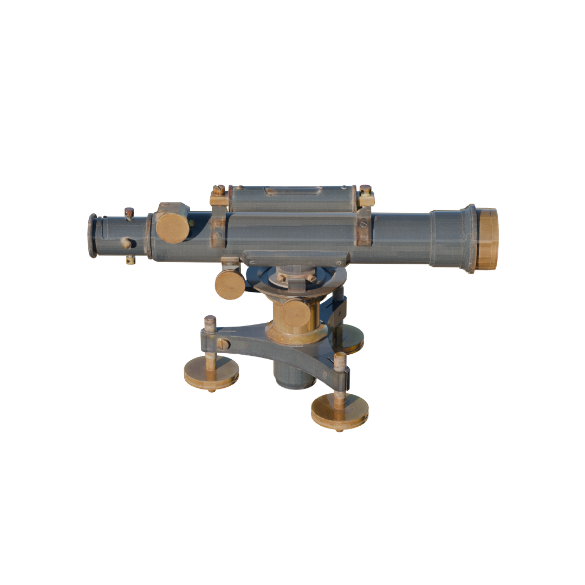

# Rendering 3D Object with PBR Material
This repo is the PBR version of [BlenderToolbox](https://github.com/HTDerekLiu/BlenderToolbox). To use this toolbox, install the following packages.
```
conda create -n blender python=3.10
conda activate blender
pip3 install blendertoolbox
pip3 install bpy
pip3 install pyav
pip3 install Pillow
```
Please make sure you're using python 3.10, as Blender Python `bpy` is only compiled for that version of python.

## Pipeline
Given a 3D object with PBR materials, our goal is to perform PBR rendering via bpy. Specifically, a 3D object with PBR materials contains three types of maps: albedo map, roughness map, and metallic map. In most cases, the roughness map and metallic map are represented as a single RGB image with three channels, where the green channel represents roughness value and the blue channel represents metallic value. In this code repository, we assume that the roughness and metallic maps are stored in this way by default. If these two maps are stored separately, you can use merge to `merge_pbr.py` to merge them into a single PBR map.

We provide a test case `0a572`

```
python3 merge_pbr.py
```

After finishing this merge process, we can render the 3D object using its obj file, albedo map and PBR map under a certain environmental map. And we recommend visiting https://polyhaven.com/ to search for the environmental map you need.

Before rendering, we first need to scale the 3D object to a unit sphere.

```
python3 scale_to_unit_sphere.py
```

To render a single image, use the python script `demo_pbr.py` and replace the `mesh_dir`, `albedo_Path`, `mr_Path` and `hdri_Path` with your own paths.

```
python3 demo_pbr.py
```

This command will produce a rendering image named `pbr.png` under your `mesh_dir`

<p align="center"></p>

To render a video, use the python script `demo_pbr_video.py` and replace the `mesh_dir`, `albedo_Path`, `mr_Path` and `hdri_Path` with your own paths.

```
python3 demo_pbr.py
```

This command will produce 360 images under `your_mesh_dir/pbr_images`. Then, you can use the python script `collect_video.py` and replace the `mesh_dir` with your own path to merge these images to a single video.

```
python3 collect_video.py
```

This command will produce a video named `pbr_video.mp4` under your `mesh_dir`.

<p align="center"></p>

## Contact

If you notice some bugs due to Blender updates or any questions/recommendations, please contact xiongbojun@pku.edu.cn

## BibTeX
```
@software{Xiong_BlenderToolboxPBR_2025,
  author = {Xiong, Bojun},
  month = {4},
  title = {{Blender Toolbox PBR}},
  url = {https://github.com/ymxbj/BlenderToolboxPBR},
  year = {2025}
}

@article{xiong2024texgaussian,
  title={TexGaussian: Generating High-quality PBR Material via Octree-based 3D Gaussian Splatting},
  author={Xiong, Bojun and Liu, Jialun and Hu, Jiakui and Wu, Chenming and Wu, Jinbo and Liu, Xing and Zhao, Chen and Ding, Errui and Lian, Zhouhui},
  journal={arXiv preprint arXiv:2411.19654},
  year={2024}
}
```
